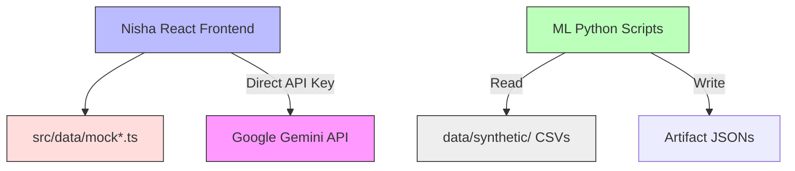

# Current Architecture (Prototype State)

The current TRINETRA repository operates as an offline prototype connecting a React-based frontend to statically generated machine learning artifacts.

## Architecture Diagram

### Components
1. **Frontend**: A React/Vite SPA providing the complete TRINETRA visual experience (Command Center, Copilot, Geo Intelligence). It reads entirely from static TS/JSON mock files.
2. **AI Copilot**: Calls Google Gemini directly from the browser using a local API key. Currently lacks dynamic backend context (RAG).
3. **ML Pipeline**: Python scripts (`ml/geographic`, `ml/timing`) that process synthetic CSV data and output evaluation metrics and payload JSONs. Runs purely offline.
