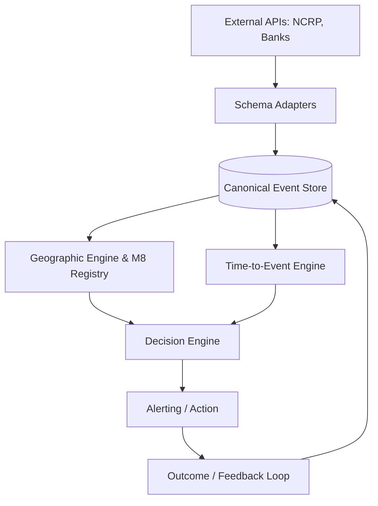

# Target Architecture

The target production architecture connects real-world banking and police data sources into the TRINETRA intelligence engines through a unified Event Store.

## Architecture Diagram

### Components
1. **Schema Adapters**: Converts external schemas into internal Canonical Events (Transaction, Complaint, Outcome).
2. **Canonical Event Store**: Stores events and enforces strict "as-of-time" querying.
3. **Geographic Engine**: Predicts top-K cash-out zones using the M8 Reliability-Aware Registry.
4. **Time-to-Event Engine**: Estimates remaining intervention window.
5. **Decision Engine**: Combines geography, timing, and financial exposure to determine urgency and emit alerts.
